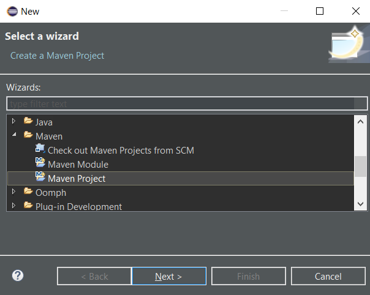
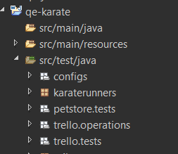
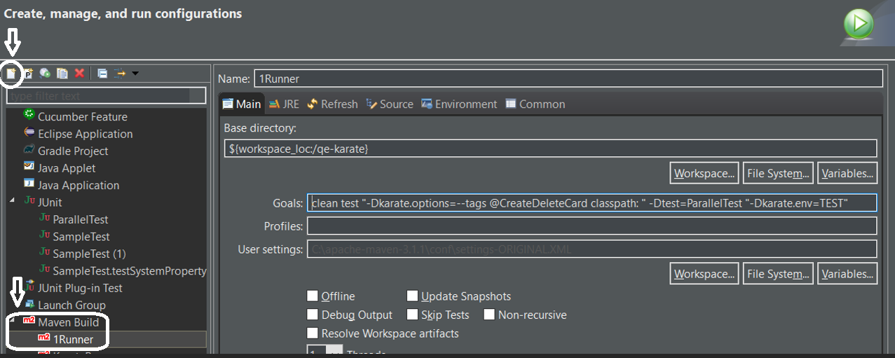
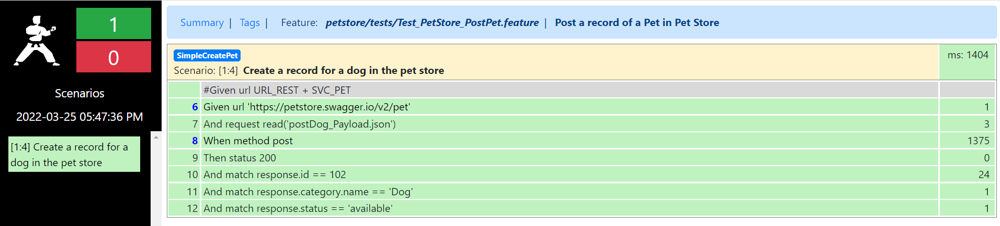
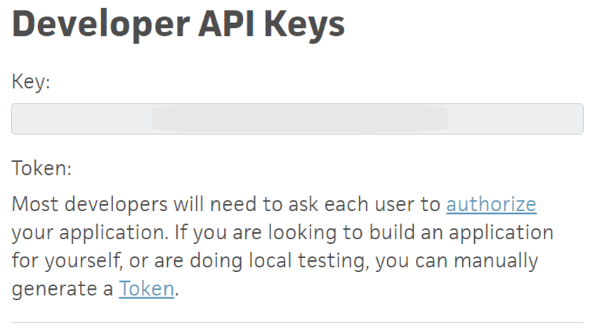
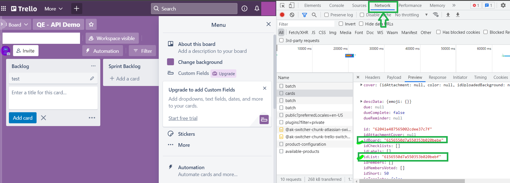

# Technovation Talks - KARATE WorkShop
Automatización de Pruebas de APIs con Karate Descubre la importancia de este tipo de pruebas y conoce una de las herramientas que se usan en el área para este propósito.


## Propósito 

Este repositorio tiene la intención de servir como una base para la exploración de las capacidades del framework de Karate.  Aquí podrán encontrar algunos ejemplos de como utilizar los keywords del framework, así como configurar un proyecto Java para usar Karate


## Precondiciones

Antes de comenzar con el workshop necesitan tener la siguiente configuración en sus maquinas

* Java OpenJDK: https://adoptopenjdk.net/
* Maven: https://maven.apache.org/install.html
* Eclipse: https://www.eclipse.org/downloads/
* Cucumber plugin: https://www.toolsqa.com/cucumber/install-cucumber-eclipse-plugin/
* Crear una cuenta de Trello para poder hacer los ejercicios: https://trello.com/en

Se recomienda tener alguna noción de lo que es el lenguaje Gherkin, pueden usar la siguiente liga para tener un entendimiento de lo que se trata

* Gherking language: https://cucumber.io/docs/gherkin/reference/


## Workshop - Step by Step

### 1. Crear el proyecto Maven:

* File > New > Other 
* Selecciona Maven Project
* Seguir las indicaciones del Wizard para completar la configuración



### 2. Configurar el POM file:

#### Dependencias:

* Para este ejercicio utilizaremos la siguiente dependencia. 

```diff
<dependency>
	<groupId>com.intuit.karate</groupId>
	<artifactId>karate-junit5</artifactId>
	<version>1.1.0</version>
	<scope>test</scope>
</dependency>
```


#### Configuración de resources:

* Debemos configurar los siguientes resources:

```diff
<build>
    <testResources>
        <testResource>
            <directory>src/test/java</directory>
            <excludes>
                <exclude>**/*.java</exclude>
            </excludes>
        </testResource>
    </testResources>        
    <plugins>
    ...
    </plugins>
</build>
```

#### Configuración de Plugins

* Los siguientes plugins son requeridos para la compilaciónn de nuestro proyecto:

```diff
<plugins>	
   <plugin>
      <groupId>org.apache.maven.plugins</groupId>
      <artifactId>maven-compiler-plugin</artifactId>
      <version>2.3.2</version>
      <configuration>
	<source>1.8</source>
	<target>1.8</target>
      </configuration>
    </plugin>	
    <plugin>
       <groupId>org.apache.maven.plugins</groupId>
       <artifactId>maven-surefire-plugin</artifactId>
       <version>2.22.2</version>
       <configuration>
	  <argLine>-Dfile.encoding=UTF-8</argLine>
	</configuration>
     </plugin>	
</plugins>
```

### 3. Estructura de folders:

Crear los siguientes folders en el build path "src/test/java"

* configs: Este folder lo usaremos para almacenar las variables para nuestro proyecto
* karaterunners: Este folder tendra las clases que usaremos para ejecutar los scripts de karate
* petstore.tests: Este paquete lo usaremos para almancenar los ejemplos que veremos usando el sitio de petstore
* trello.tests: Este paquete lo usaremos para almacenar los tests de ejemplo con Trello
* trello.operations: Este paquete lo usaremos para las operaciones del ejemplo con Trello




Nota: Regularmente en Maven, todos los archivos "non-Java" deben ir en "src/test/resources". Pero la recomendación de Karate es mantenerlos en el mismo lugar que nuestros archivos *.java. 


### 4. Crear el Test Runner:

* En el folder "karaterunners", crear una clase llamada "ParallelTest.java" y poner el siguiente código:

```diff
package runners;

import com.intuit.karate.Results;
import com.intuit.karate.Runner;
import static org.junit.jupiter.api.Assertions.*;
import org.junit.jupiter.api.Test;

public class ParallelTest {

	//Runner for JUnit 4 Parallel Execution
    @Test
    void testParallel() {
        Results results = Runner.path("classpath:").tags("@SimpleCreatePet").parallel(5);
        assertEquals(0, results.getFailCount(), results.getErrorMessages());
      	
    }
    
}
```

### 5. Primer Test Ejemplo

* En el package "petstore.tests", crear un archivo feature file llamado “Test_PetStore_PostPet.feature”, Copia las siguientes líneas para definir el Scenario:

```diff
Feature: Post a record of a Pet in Pet Store

@SimpleCreatePet
Scenario: Create a record for a dog in the pet store
	Given url 'https://petstore.swagger.io/v2/pet'
	And request read('payload.json')
	When method post
	Then status 200
	And match response.id == 102
	And match response.category.name == 'Dog'
	And match response.status == 'available'
```

* En el package "petstore.tests", crea un archivo json y normbralo “postDog_Payload.json”, Copia el siguiente contenido:

```diff
{
  "id": 102,
  "category": {
    "id": 2,
    "name": "Dog"
  },
  "name": "Doggies",
  "photoUrls": [
    "http://mycdogphotos.com"
  ],
  "tags": [
    {
      "id": 2,
      "name": "Doggies"
    }
  ],
  "status": "available"
}
```

### 6.	Ejecución del Test:

Sigue los siguientes pasos para poder hacer la ejecución de la prueba por medio del comando maven:

* Click derecho sobre el project 

* Selecionar "Run As > Run Configurations"

* Crea una nueva configuracion Maven



* Copia el siguiente comando como goal:

```diff
clean test "-Dkarate.options=--tags @SimpleCreatePet  classpath: " -Dtest=ParallelTest
```
* clean test: es el comando mvn con el que indicamos lanzaremos la prueba
* -Dkarate.options=--tags: es la manera en la que indicamos que test (@tag) queremos que Karate ejecute
* classpath: Indica el lugar dentro del proyecto en donde estan nuestros archivos feature
* -Dtest: especificamos el runner a utilizar


### 7. Reporte de Ejecución

Al terminar la ejecución, Karate nos mostrara un path hacia el reporte de resultados:

```diff
HTML report: (paste into browser to view) | Karate version: 1.1.0
file:///C:/Users/your.id/workspaceFolder/qe-karate/target/karate-reports/karate-summary.html
===================================================================

[INFO] Tests run: 1, Failures: 0, Errors: 0, Skipped: 0, Time elapsed: 4.553 s - in karaterunners.ParallelTest
[INFO] 
[INFO] Results:
[INFO] 
[INFO] Tests run: 1, Failures: 0, Errors: 0, Skipped: 0
[INFO] 
[INFO] ------------------------------------------------------------------------
[INFO] BUILD SUCCESS
[INFO] ------------------------------------------------------------------------
[INFO] Total time: 8.203 s
[INFO] Finished at: 2022-03-25T17:47:37-06:00
[INFO] ------------------------------------------------------------------------
```

Este reporte nos dara detalles de cada paso, su estatus y tiempo de ejecución:




### 8. Usar "Scenario Outline", para crear 2 Tests usando los mismos pasos.

* En la misma feature file, copiar el siguiente código. Importante ver como en lugar del Keyword "Scenario" usamos "Scenario Outline" y con este una nueva sección llamada "Examples:"

```diff
@CreateTwoPets
Scenario Outline: Create a record for a <scenario> in the pet store
	#Given url URL_REST + SVC_PET
	Given url 'https://petstore.swagger.io/v2/pet'
	And request read(<payload>)
	When method post
	Then status 200
	And match response.id == <id>
	And match response.category.name == <scenario>
	And match response.status == 'available'
	
Examples:
    | scenario | id | payload                |
    | 'Dog'    | 102 | 'postDog_Payload.json' |
    | 'Cat'    | 101 | 'postCat_Payload.json' |     
```

* Crear un archivo llamado “postCat_Payload.json”, con el siguiente contenido:

```diff
{
  "id": 101,
  "category": {
    "id": 1,
    "name": "Cat"
  },
  "name": "Kitty",
  "photoUrls": [
    "http://mycatphotos.com"
  ],
  "tags": [
    {
      "id": 1,
      "name": "kittens"
    }
  ],
  "status": "available"
}


```

### 9. Configuraciónn del archivo "Logback":

* Para que Karate genere un log llamado "Karate.log" es necesaro crear un archivo llamdo "logback-test.xml" con el siguiente contenido. Una vez habilitado tendran la posibilidad de ver un archivo "Karate.log" generado en el folder target en cada ejecución


```diff
<?xml version="1.0" encoding="UTF-8"?>
<configuration>
 
    <appender name="STDOUT" class="ch.qos.logback.core.ConsoleAppender">
        <encoder>
            <pattern>%d{HH:mm:ss.SSS} [%thread] %-5level %logger{36} - %msg%n</pattern>
        </encoder>
    </appender>
  
    <appender name="FILE" class="ch.qos.logback.core.FileAppender">
        <file>target/karate.log</file>
        <encoder>
            <pattern>%d{HH:mm:ss.SSS} [%thread] %-5level %logger{36} - %msg%n</pattern>
        </encoder>
    </appender>    
   
    <logger name="com.intuit.karate" level="DEBUG"/>
   
    <root level="info">
        <appender-ref ref="STDOUT" />
        <appender-ref ref="FILE" />
    </root>

</configuration>
```

### 10. Variables globales y switch de ambientes

Crear un archivo para almacenar los endpoint URLs:
* En el folder src/test/java/configs, crear un archivo llamado "endPoints.json"
* Copiar el siguiente contenido:

```diff
{      
       "DEV": {
             "URL_PetStore": "https://petstore.swagger.io"
       },
       
       "TEST": {
             "URL_PetStore": "https://petstore.swagger.io"
       },
       "UAT": {
			"URL_PetStore": "http://localhost:8089"
		}
}
```

Crear un archivo para almacenar variables globales:
* En el folder src/test/java/configs, crear un archivo llamado "globalVariables.json"
* Copiar el siguiente contenido:

```diff
{ 
	"PATH_TRELLO_OPS": 'classpath:trello/operations/', 
    "SVC_PET": '/v2/pet',
    "SVC_USER": '/v2/user',
    "SVC_CARDS": '/1/cards'        	
}
```

Crear el archivo "Karate-config", que se encargara de cargar las variables cada comienzo de ejecucion:
* En el folder src/test/java, crear un archivo llamado "karate-config.js"
* Copiar el siguiente contenido:

```diff
Under src/test/java create the karate-config.js
function  fn() {    
	  var env = karate.env; // get java system property 'karate.env'
	  karate.log('karate.env system property was:', env);
	  
	if (!env) {
		env = 'DEV';
	} 
	
	var config; 			
	config=karate.read('classpath:configs/globalVariables.json');
	config.myEndPoints = karate.read('classpath:configs/endPoints.json');

	if (env == 'DEV') {
		config.URL_PetStore = config.myEndPoints.DEV.URL_PetStore;
		} 
	else if (env == 'TEST') {
		config.URL_PetStore = config.myEndPoints.TEST.URL_PetStore;
		} 
	else if (env == 'UAT'){
		config.URL_PetStore = config.myEndPoints.UAT.URL_PetStore;	    		    			  
	  	}

	  // don't waste time waiting for a connection or if servers don't respond within 5 seconds
	  karate.configure('connectTimeout', 5000);
	  karate.configure('readTimeout', 5000);
	karate.log("myconfig "+config);	   		
	return config;
}

```
* Para probar, en el mismo archivo Test_PetStore_PostPet.feature copiar el siguiente test:

```diff
@UseConfigFiles
Scenario: Create a record for a dog in the pet store using URL from Config Files
	Given url URL_PetStore + SVC_PET
	And request read('postDog_Payload.json')
	When method post
	Then status 200
	And match response.id == 102
	And match response.category.name == 'Dog'
	And match response.status == 'available'
```

* Para ejecutar, usar elsiguiente comando mvn (agregando ahora la variable karate.env):

```diff
clean test "-Dkarate.options=--tags @UseConfigFiles classpath:tests " -Dtest=ParallelTest "-Dkarate.env=TEST"
```

### 11. FuzzyMatching:

En el mismo feature, crear el siguinte TC 
* Puedes descomentarizar la ultima linea para ver el test fallar

```diff
@FuzzyMatching
Scenario: Create a record for a dog in the pet store using URL from Config Files
	Given url URL_PetStore + SVC_PET
	And request read('postDog_Payload.json')
	When method post
	Then status 200
	And match response.id == 102
	And match response == {"id":102,"category":{"id":2,"name":"Dog"},"name":"Doggies","photoUrls":["http://mycdogphotos.com"],"tags":[{"id":2,"name":"Doggies"}],"status":"available"}
	And match response == {"id":'#number',"category":{"id":'#number',"name":'#string'},"name":'#string',"photoUrls":["http://mycdogphotos.com"],"tags":[{"id":'#number',"name":'#string'}],"status":'#string'}	
	#And match response == {"id":'#string',"category":{"id":'#number',"name":'#string'},"name":'#string',"photoUrls":["http://mycdogphotos.com"],"tags":[{"id":'#number',"name":'#string'}],"status":'#string'}
```


###  12. Preparación para el ejemplo con Trello:

Para este ejemplo utilizaremos los siguientes APIs de Trello
"Trello is a web-based, Kanban-style, list-making application and is developed by Trello Enterprise, a subsidiary of Atlassian."
developer.atlassian.com/cloud/trello/guides/rest-api/api-introduction/

Generar Token
* You should create an account to ensure you are logged in and able to generate the APPKEY and TOKEN be logged
* Once login in Trello, navigate to: https://trello.com/app-key
* Take note of the value displayed for the Key 
* Click on the Token link and take note of the value for the token





Pasos a seguir para preparar la prueba:

* Crear un board llamado "QE - API DEMO"
* Crear una lista dentro del board "Backlog"
* Obtener el ID del board y de la lista. Para esto puedes crear manualmente una tarjeta e inspeccionarla con F12



###  13. Asegurar que en el Karate Config files tenemos el endpoint y las variables para Trello:

In Endpoint

* "URL_Trello": "https://api.trello.com" 

In globalVariables: 

* "SVC_CARDS" :  '/1/cards',

* "APPKEY" : "enter the value noted for key",

* "TOKEN" : "enter the value noted for token",
		
* Create a feature file called “Test_Cards.feature” in src/test/java/trello/tests. Copy below:


###  14. Crear El feature file para crear una tarjeta:

```diff
Feature: Functionalities for Cards section in Trello
@CreateCard
Scenario: Create a Card
	Given url URL_Trello + SVC_CARDS
	And params { key: '#(APPKEY)', token: '#(TOKEN)'}
	And request read('postCard_Payload.json')
	When method post
	Then status 200
	And def cardId = response.id
	* print cardId
```

* Crear un json file llamado “postCard_Payload.json” en src/test/java/trello/tests. Copiar el siguiente contenido:

```diff
{
    "name": "1001 - Test Auto Task",
    "desc": "This is a test Automation Task",
    "closed": false,
    "idLabels": "6156550dec7b9d8da4d68890",
    "idBoard": "6156550d7a550353b020bebe",
    "idList": "6156550d7a550353b020bebf"
}
```

* MVN Command

```diff
Run the test: clean test "-Dkarate.options=--tags @ CreateCard  classpath: " -Dtest=ParallelTest "-Dkarate.env=TEST"
```

### 15. Crear el feature file para Delete a Card

Crear otro escenario, donde el valor del ID vendra del test anterior (*no olvides actualizar el ID de la tarjeta):

```diff
@DeleteCard
Scenario: Delete a Card
	Given url URL_Trello + SVC_CARDS + '/6203e614feef488f8b27d63e'
	And params { key: '#(APPKEY)', token: '#(TOKEN)'}
	When method delete
	Then status 200
```

### 16	Test Creation and Deletion together:

Create 2 features under the Trello.operations
-	deleteCard.feature
-	postCard.feature


* In postcard.feature write

```diff
@ignore
Feature: Functionalities for Cards section in Trello

Scenario: Post Card
	Given url URL_Trello + SVC_CARDS
	And params { key: '#(APPKEY)', token: '#(TOKEN)'}
	And request payload
	When method post
```

* In deleteCard.feature

```diff
@ignore
Feature: Delete Card

Scenario: Delete Card
	Given url URL_Trello + SVC_CARDS + '/' + CardId
	And params { key: '#(APPKEY)', token: '#(TOKEN)'}
	When method delete
```

En el achivo feature file "Test_Cards.feature" escribit el siguiente scenario:

```diff
@CreateDeleteCard
Scenario: Create and Delete Feature
  #Create a Card
  Given def payloadCard = read('postCard_Payload.json')
	When def post = call read('classpath:trello/operations/postCard.feature') { payload : '#(payloadCard)' }
  Then match post.responseStatus == 200
	#Save the ID
	And def cardId = post.response.id
	#Delete the created card using the ID
	Given print cardId
	When def delete = call read('classpath:trello/operations/deleteCard.feature') { CardId : '#(cardId)' }	
  Then match delete.responseStatus == 200
```

Ejecutar la prueba con el siguiente comando: 

```diff
Run the test: clean test "-Dkarate.options=--tags @CreateDeleteCard classpath: " -Dtest=ParallelTest "-Dkarate.env=TEST"
```
	
	
### 17	Algunos tipos de validaciones con match:	

Crear otro archivo feature en el folder de operaciones de trello: "getCard.feature"

```diff
@ignore
Feature: Obtain a card

Scenario: Get a Card
	Given url URL_Trello + SVC_CARDS + '/' + CardId 
	And params { key: '#(APPKEY)', token: '#(TOKEN)'}
	When method get
```
	
Agregaremos las siguientes validaciones
* Match == 
* match =!
* match contains
* match !contains

Creamos otro scenario para agregar el GET y validaciones sobre la respuesta del get

```diff
Scenario: Example to show some match types
  #Create a Card
  Given def payloadCard = read('postCard_Payload.json')
	When def post = call read('classpath:trello/operations/postCard.feature') { payload : '#(payloadCard)' }
  Then match post.responseStatus == 200
	#Save the ID
	And def cardId = post.response.id
	#Print response and id
	* print post.response
	* print post.response.id
		
	When def get = call read('classpath:trello/operations/getCard.feature') { CardId : '#(cardId)' }	
  Then match get.responseStatus == 200

	#Print response and id
	* print get.response
	* print get.response.id	

	* match get.response.id == cardId
	* match get.responseStatus != 404
	* match get.response contains { closed : false }
	* match get.response !contains { other : true }

	#Wait for sometime for the example
	* def makePause = function(pause){ java.lang.Thread.sleep(pause) }
	* def pause = makePause(7000)
		
	#Delete the created card using the ID
	Given print cardId
	When def delete = call read('classpath:trello/operations/deleteCard.feature') { CardId : '#(cardId)' }	
  Then match delete.responseStatus == 200 
```

### 18	Calling Java Functions:

* Crear un paquete llamadao utils 
* Crear una Clase llamada RandomNumberGenerator.java
* Crear el metodo RandomNumberGenerator

```diff
package utils;

import java.util.Random;

public class RandomNumberGenerator {
	
	public static int randomNumber(int num) {

		Random r = new Random( System.currentTimeMillis() );
	    return ((1 + r.nextInt(2)) * 10000 + r.nextInt(10000));
		
	}
}
```

### 19	Calling Java Script:		

* En src/test/java/utils, crear un archivo llamado "toUpperCase.js"
* Escribir el siguiente codigo

```diff
function(string){ 
	var valInUpperCase = "";
	valInUpperCase = string.toUpperCase()
	return valInUpperCase;
}
```
* En el mismo feature de Test_Cards, Crear el siguiente scenario

```diff
@CallJS
Scenario: Call Java Script
Given def word = call read('classpath:utils/toUpperCase.js') 'quality engineering' 
And print word

```

* Ejecutar usando el siguiente comando

```diff
clean test "-Dkarate.options=--tags @CallJS classpath: " -Dtest=ParallelTest "-Dkarate.env=TEST"

```


